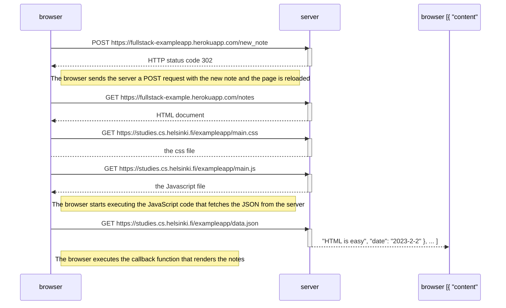

Here is an example sequence diagram:

```mermaid
sequenceDiagram
    participant browser
    participant server

    browser->>server: POST https://fullstack-exampleapp.herokuapp.com/new_note
    activate server
    server-->>browser: HTTP status code 302
    deactivate server

    Note right of browser: The browser sends the server a POST request with the new note and the page is reloaded

    browser->>server: GET https://fullstack-example.herokuapp.com/notes
    activate server
    server-->>browser: HTML document
    deactivate server

    browser->>server: GET https://studies.cs.helsinki.fi/exampleapp/main.css
    activate server
    server-->browser: the css file
    deactivate server

    browser->>server: GET https://studies.cs.helsinki.fi/exampleapp/main.js
    activate server
    server-->>browser: the Javascript file
    deactivate server

    Note right of browser: The browser starts executing the JavaScript code that fetches the JSON from the server

    browser->>server: GET https://studies.cs.helsinki.fi/exampleapp/data.json
    activate server
    server-->>browser [{ "content": "HTML is easy", "date": "2023-2-2" }, ... ]
    deactivate server

    Note right of browser: The browser executes the callback function that renders the notes
```